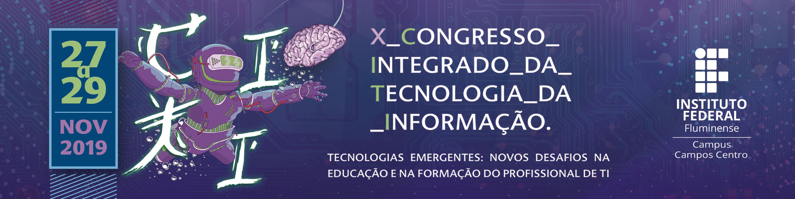
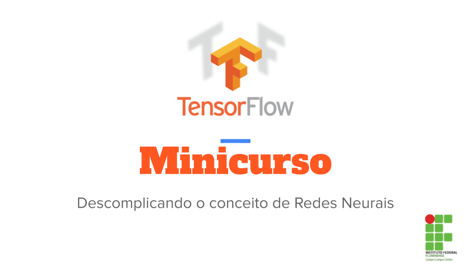

# Minicurso TensorFlow
Bem vindo ao minicurso de TensorFlow básico, neste repositório você encontrará todo o material utilizado no minicurso durante o 10º Congresso Integrado da Tecnologia da Informação (CITI) promovido pelo Instituto Federal Fluminense campus Campos Centro.

## Tópicos abordados no minicurso

* O que é uma rede neural, seus tipos e como começar
* Entender o que é o TensorFlow e como ele trabalha
* Laboratório 1: Entendendo a estrutura do TensorFlow
* Estudo de caso: Classificando imagens de roupas com o Keras 
* Laboratório 2: Classificando imagens de roupas com o Keras

##### Ministrante: Ronald Lopes
##### Site do congresso: http://citi2019.centro.iff.edu.br/apresentacao